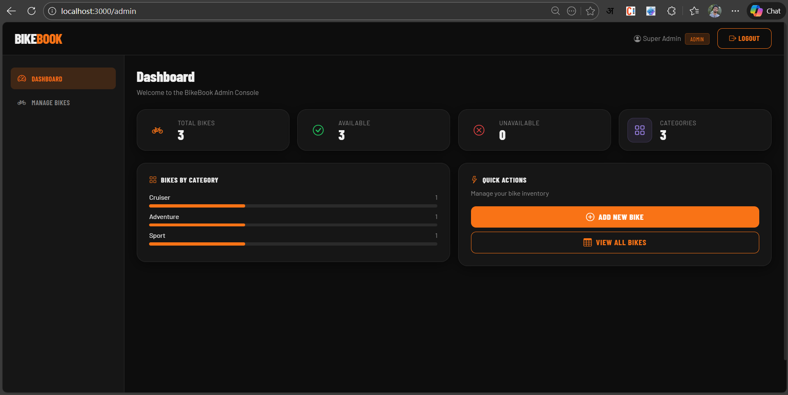
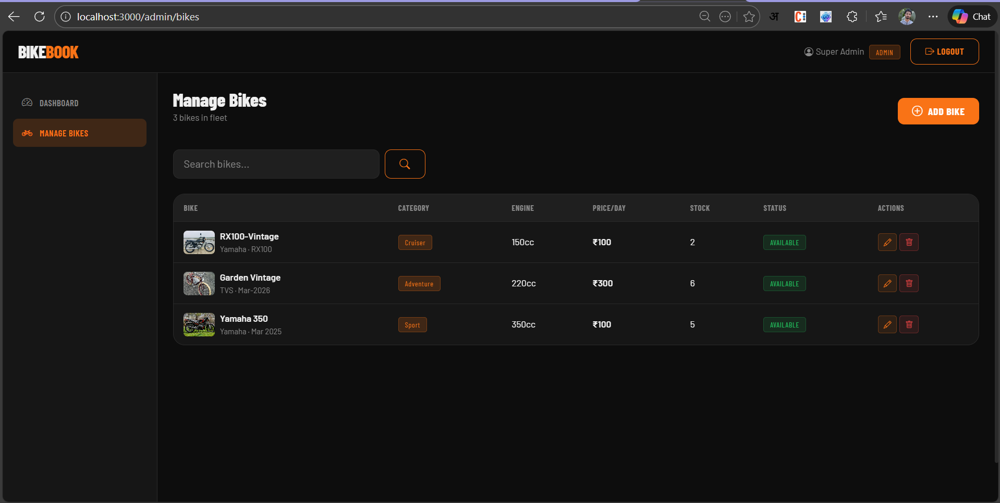
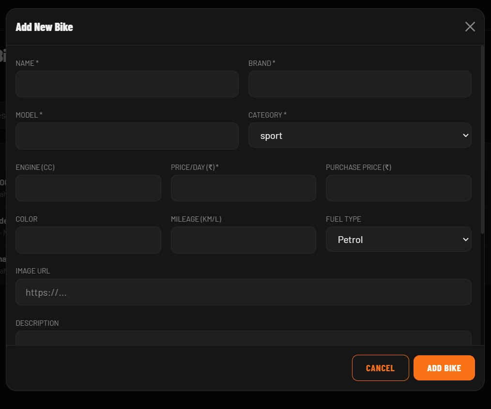
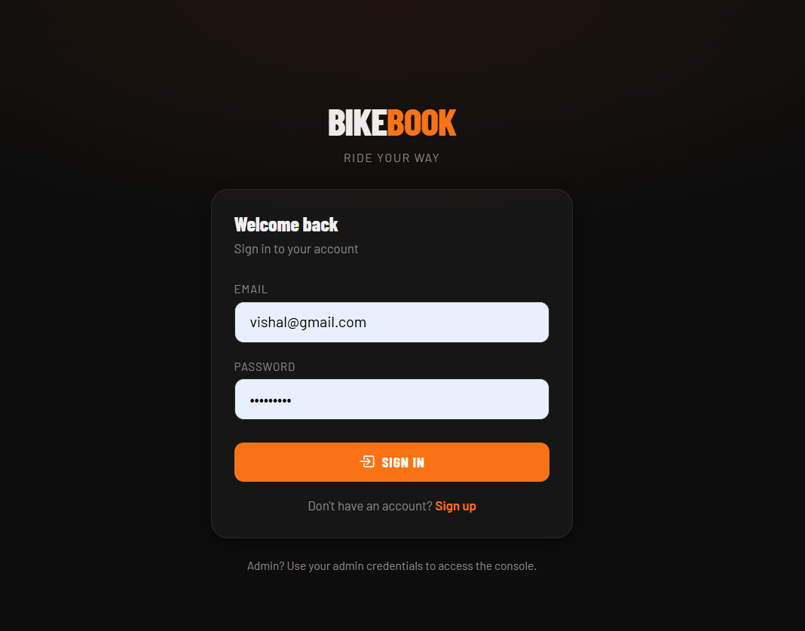
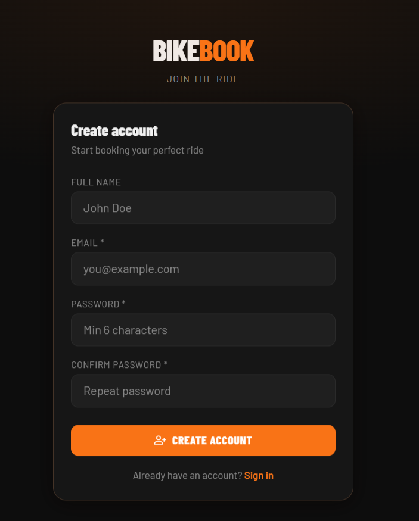
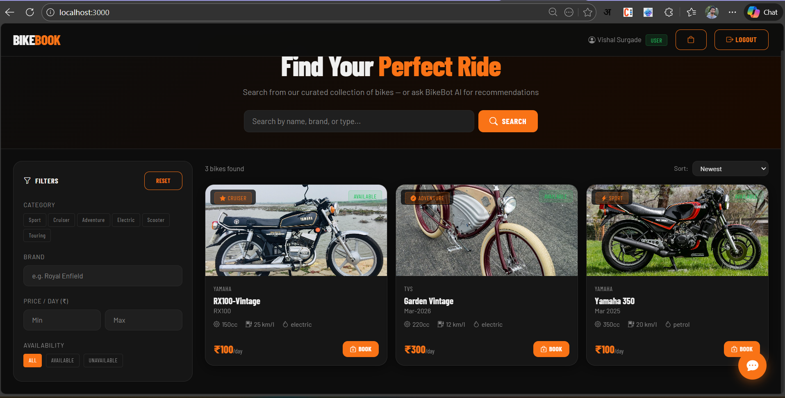
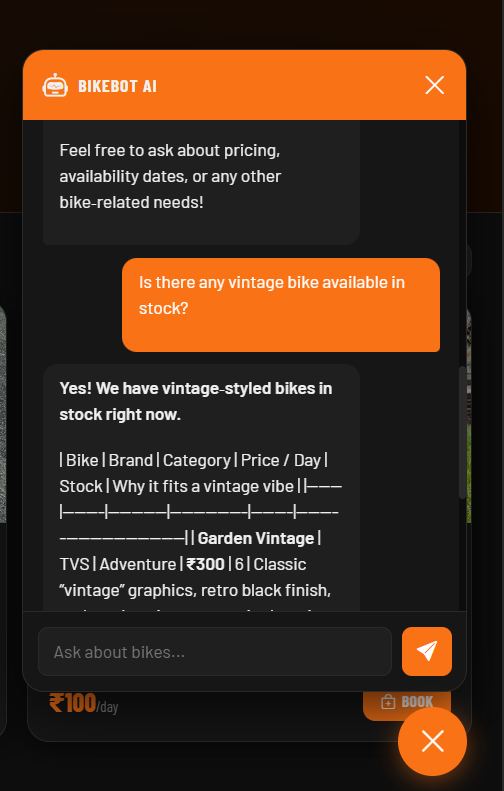
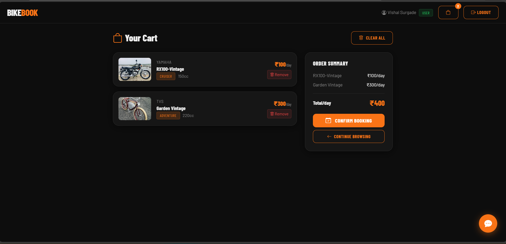

# Online - Bikes

## Recommanded versions 
1. Node - v25.0.0
2. Python - 3.13.4

## Setup Front end 
1. Go inside online-bikes folder
2. run command `npm i`
3. run command `npm start`

## Setup Postgresql, Redis, Groq API
1. Use given docker compose file to download imges and run 
2. run command `docker compose up -d`
3. Above command will setup Postgresql and Redis follow below steps for groq
4. Create account on [Groq Console](https://console.groq.com/)
5. Create API Token 
6. Paste API token in config.py file

## Setup Database 
1. Use give `online-bikes.sql` file and execute in postgresql editor

## Setup Backend
1. Go inside app folder 
2. python -m venv venv (Create virtual ENV)
3. Activate virtual env `source venv/Scripts/activate`
4. run command `pip install -r requirements.txt`
5. Come outside app fodler `cd ..`
6. run command `uvicorn app.main:app --reload`

### Screenshots

## Admin (admin@bikebook.com / Admin@123)
1. Dashboard

2. Manage Bikes

3. Add Bike in collection

## User (vishal@gmail.com / Admin@123)
1. Login 

2. Signup 

3. Landing Page

4. AI Chatbot

5. Cart

## Tech stack used
1. Front end
   1. React
   2. Bootstrap 
2. Back end 
   1. Python Fast API
   2. Redis
   3. Postgresql